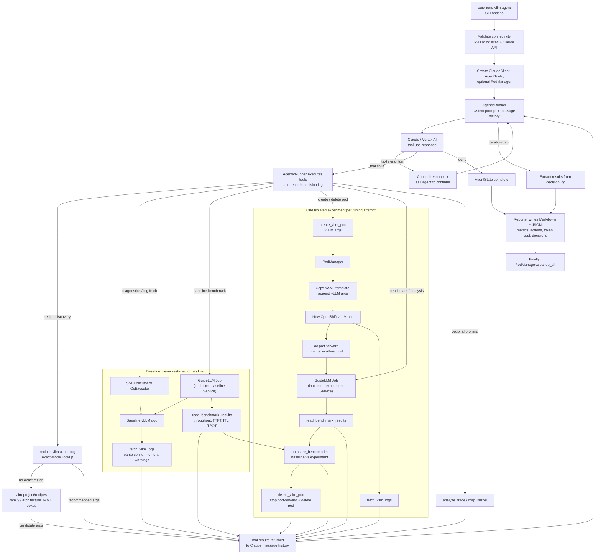

# Agentic Tuning Flow

The agent is a Claude-driven tool loop: Claude proposes actions, the runner
executes them, feeds results back, and repeats. The baseline vLLM pod is
read-only; every configuration change is tested in a fresh ephemeral pod.

## Decision cycle

1. Check the vLLM Recipes catalog and, when needed, its source repository for
   exact-model or family/architecture-level YAML recommendations.
2. Inspect and benchmark the baseline, then parse its logs and metrics.
3. Claude selects one vLLM configuration change.
4. A new pod is created from the template with the change.
5. The experiment is benchmarked and inspected.
6. Its results are compared with the baseline; its pod is deleted.
7. The loop continues until Claude signals completion or the configured
   iteration limit is reached, then the reporter writes Markdown and JSON
   outputs.

## Current enforcement detail

The system prompt asks Claude to stop after 10 consecutive non-improving
experiments. This is prompt-guided, rather than mechanically enforced by the
runner. The hard stop is `max_iterations`; at that cap, the runner derives a
fallback summary from the decision log.
